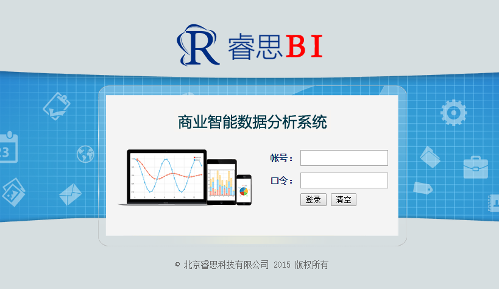

# 睿思BI商业智能系统介绍

  “睿思BI”商业智能系统V3.0是由[北京睿思科技有限公司](http://www.ruisitech.com)自主研发的，具有自主知识产权的企业数据分析系统。 系统包含数据导入、数据建模、多维分析、明细查询、报表、移动BI等功能模块，方便企业快速建立一套易用，灵活、低成本的商业智能平台，通过数据了解企业经营情况，以数据支撑管理决策。
  
  

主要功能模块：

* 数据导入

* 数据填报

* 明细查询

* 数据建模

* 多维分析

* 睿思报表

* 移动BI