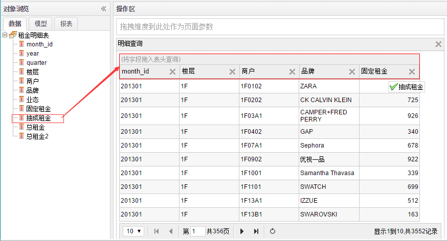
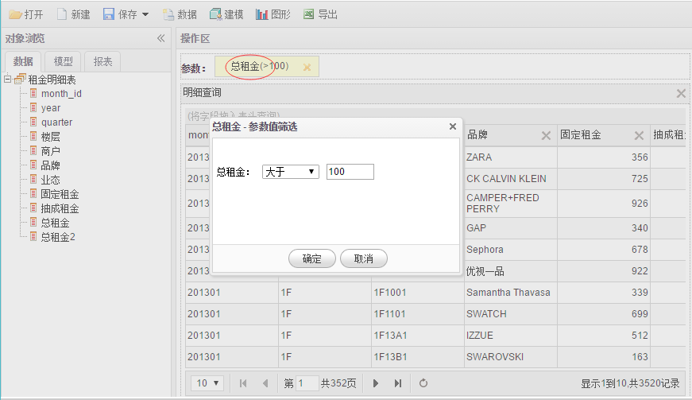

# 查询

1.在**明细查询**页面点击**数据**按钮，在弹出的数据列表框中勾选想要查询的数据。如果无数据请先**建模**。

2.从**数据**选项卡拖拽字段到**表格表头**查询字段数据。 点击字段 **X** 按钮删除已选字段。

3.从**数据**选项卡拖拽字段到**页面参数**区域作为页面查询条件。

4.点击**参数**弹出**参数值筛选**对话框，配置参数筛选条件及筛选值。

5.点击**导出**菜单导出数据。