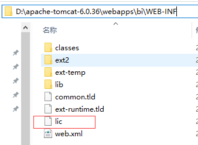

# 系统安装

所需软件及版本：

* MySQL5.0及以上版本；
* JDK1.5及以上版本；
* Tomcat5.5及以上版本;

从[北京睿思科技有限公司](http://www.ruisitech.com)网站下载最新版“睿思BI”标准版程序，下载地址：[睿思BI下载](http://www.ruisitech.com/download.html)

1.安装MYSQL

MySQL下载地址：[MySQL5.5](http://www.ruisitech.com/tools/mysql5.5.27_win64_zol.zip)，下载后直接解压安装即可。安装完成后，请在环境变量中设置mysql 的path，如下图：


本电脑上MySQL路径为：C:\Program Files\MySQL\MySQL Server 5.5\bin

2.安装JDK

JDK下载地址：[JDK7](http://www.ruisitech.com/tools/jdk-7u71-windows-x64.exe).下载完成后直接安装即可。安装完成后，请在环境变量中设置JAVA\_HOME, 如下图：


本电脑上JDK路径：C:\Program Files\Java\jdk1.7.0\_71

3.安装Tomcat

Tomcat下载地址：[Tomcat7.0](http://www.ruisitech.com/tools/apache-tomcat-7.0.61-windows-x64.zip)，下载完成后解压即可。进入Tomcat 的 bin 目录，执行startup.bat文件启动tomcat，如果启动失败，请先设置JAVA\_HOME环境变量。

4.安装数据

解压睿思BI下载文件夹中 bi数据.zip, bi数据.zip包含 yunbi\_sys.bak 及 yunbi.bak 两文件，分别对应MYSQL两个数据库。

进入MYSQL建立 yunbi\_sys 数据库及 yunbi 数据库，注意名称一致。

```
mysql -u root -p            //从命令提示符（CMD）进入MySQL
create database yunbi_sys   //创建yunbi_sys数据库
create database yunbi       //创建yunbi数据库
```

用mysql命令还原数据到数据库中，相关命令为：

```
 mysql –uroot –pxxxxxx yunbi_sys<yunbi_sys.bak  
 mysql –uroot –pxxxxxx yunbi<yunbi.bak
```

其中xxxxxx代表你的数据库root账号的密码。

5.安装程序

解压下载文件夹中bi.zip, 把解压的文件拷入 TOMCAT 的 webapps 目录，目录名称 bi。

修改 bi/WEB-INF/classes/database.properties 文件，主要修改 password 这项内容，既你数据库账户root的密码，如果您的MYSQL root密码是123456，则不用修改。

`driver=com.mysql.jdbc.Driver  
url=jdbc:mysql://localhost/yunbi?useUnicode=true&characterEncoding=UTF8  
username=root  
password=123456`

启动tomcat, 输入 [http://localhost:8080/bi](http://localhost:8080/bi) 访问系统，如果看到登录页面，系统配置成功。

登录用户名/密码：admin/123456

6.安装License

登录 [http://www.ruisitech.com/license.html](http://www.ruisitech.com/license.html) 下载 license文件。

把下载的lic文件放入 bi/WEB-INF/ 目录下。



重启系统。

