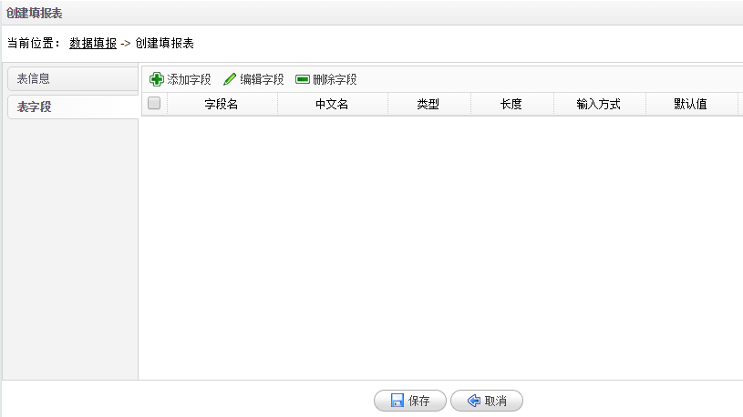
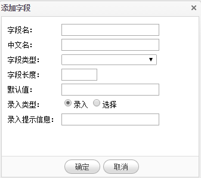
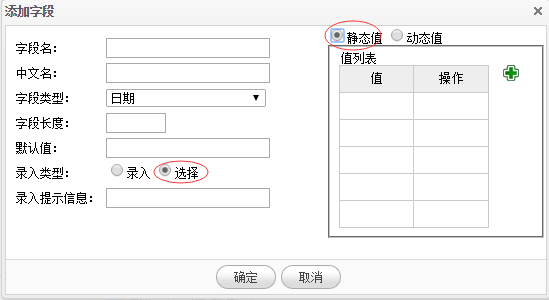
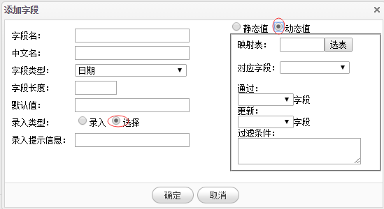

# 创建填报表

1.在**数据填报**页面点击**创建填报表**，系统进入创建填报表页面。通过定义填报表数据字段及格式，方便用户录入自己的数据到BI系统中。

2.录入表名、中文名等基本信息后，点击**表字段**选项卡，点击**添加字段**菜单创建一个新的字段。

3.填报表**字段类型**分为字符串、整数、小数、日期（不包含时分秒）、时间（包含时分秒）。**录入类型**支持录入和选择，录入是用户手动填写数据到字段，选择是通过下拉框的方式从列表中选择数据，下拉框里的数据可以来源于一个表，也可以是用户自定义的列表。

4.当**录入类型**是选择时，**静态值**表示选择下拉框的数据直接在这里创建，点击**加号**创建静态值。

5.当**录入类型**是选择时，**动态值**表示选择下拉框的数据来源于一个已经创建的填报表，点击**选择**按钮选择表，并选择**对应字段**。同时支持通过映射表的字段更新当前表的字段数据。**过滤条件**是指对映射表数据的筛选，比如过滤条件录入 a=1, 则在选择值时子列出字段a=1等满足条件的数据。

6.点击**确定**按钮完成填报表的创建。