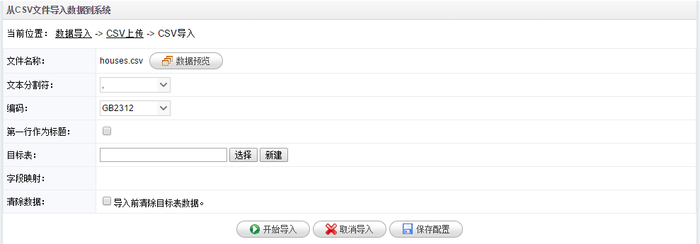
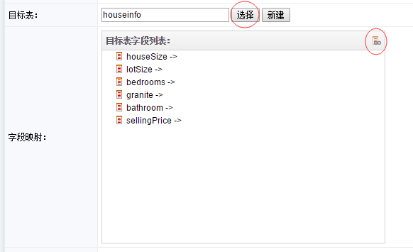

# CSV导入

1.在**数据导入**页面点击**CSV导入**菜单，系统进入数据导入页面。

2.点击**选择文件**上传需要导入的CSV文件，CSV文件是按逗号分割的文本文件。上传完成后，页面自动跳转到CSV导入页面，如下图：

3.点击**数据预览**可以查看CSV文件中的数据。如果是第一次导入，点击**新建**按钮来创建一个目标表。如果目标表已经存在，点击**选择**按钮从BI系统中选择表。如果CSV文件中包含标题，请勾选**第一行作为标题**，这样在创建表的时候能以第一行默认作为表字段。

4.在新建表里录入表名，修改字段类型，完成去点击**确定**按钮创建表。

5.点击**选择**按钮选择刚才创建的表，系统会自动列出表字段。

6.点击上图右边按钮完成数据字段的自动映射，也可以点击字段列表手动和数据字段进行映射。

7.点击**开始导入**导入数据到系统中，点击**取消导入**退出导入页面，点击**保存配置**保存此次导入的配置信息，下次可以从**配置信息**菜单进入快速导入。

