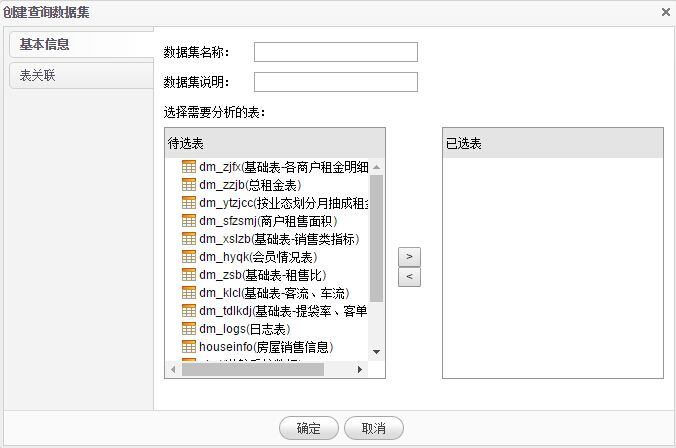
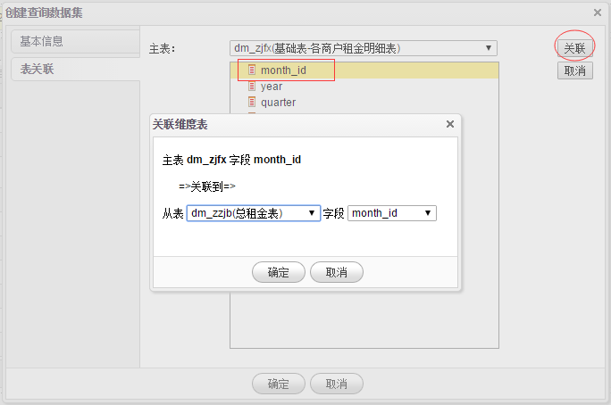
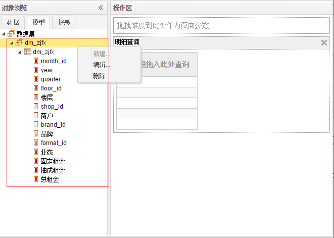
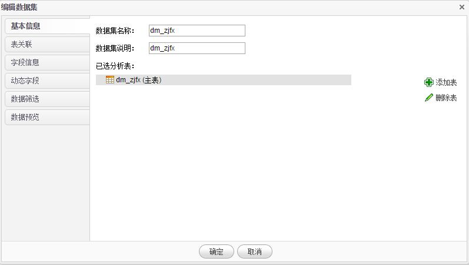
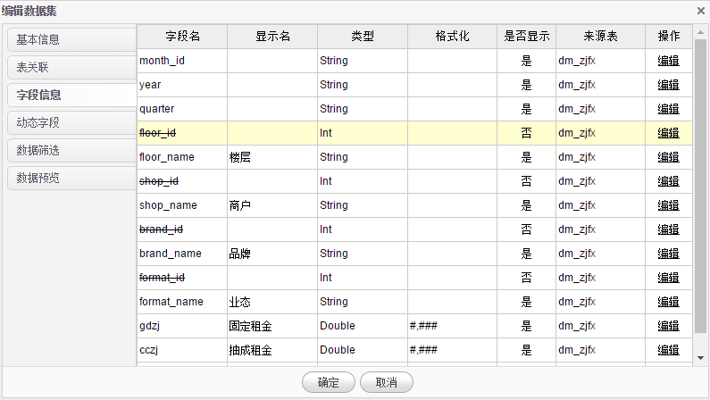

# 建模

1.导入的数据只能通过**建模**后，才能在**明细查询**中查询。在**明细查询**页面点击**建模**菜单，系统弹出**创建查询数据集**对话框。

2.录入名称、说明等信息，从**待选表**里选择表，点击 **>** 按钮，选择表到**已选表**框。用户可以选择多个表，选择多个表后，需要在**表关联**选项卡建立多表关联。

3.点击**表关联**选项卡，进入多表关联配置页面，首页设置**主表**，选择主表需要关联的字段，点击**关联**按钮，在弹出的**关联维度表**对话框中选择关联的**从表**及**字段**。点击**确定**按钮完成关联。

4.建立上表关联后，点击**确定**按钮，明细查询数据集创建完成，用户可以在**模型-数据集**选项卡找到刚才创建的内容。在数据集上点击**右键**，可以编辑、删除数据集。

5.点击**编辑**菜单，对数据集进一步编辑。

6.编辑数据集包含基本信息、表关联、字段信息、动态字段、数据筛选、数据预览等功能，在**基本信息**选项卡列出了用户已经选择的表，点击**添加表**添加新的表，添加表后需要在**表关联**选项卡重新关联，点击**删除表**删除已选表，

7.**字段信息**选项卡列出数据集所有字段信息。

