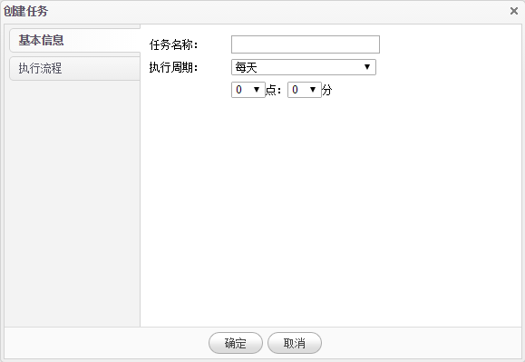
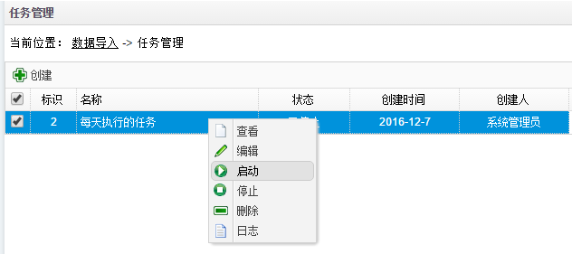

# 任务管理

1.在**数据导入**页面点击**任务管理**菜单，系统进入任务管理页面。任务管理可以创建按小时、天、周、月等周期定时执行的任务，并把数据导入、数据转换、SQL脚本等过程放入任务中定时执行，实现数据处理的自动化。

2.点击**新建**按钮创建新的任务。

3.录入任务名称，选择任务执行周期，选择执行的过程，点击**确定**完成任务的创建。

4.在已创建的任务列表上点击**右键**，选择**启动**菜单来启动刚才创建的任务。

5.点击**查看**菜单查看任务详细信息，点击**编辑**菜单修改任务，点击**停止**菜单停止已经启动的任务，点击**删除**菜单删除此条任务，点击**日志**菜单查看任务执行的日志信息。