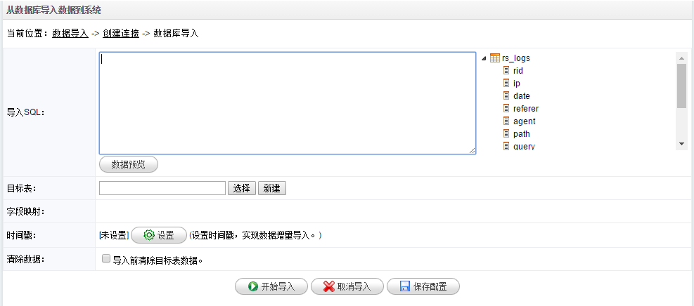
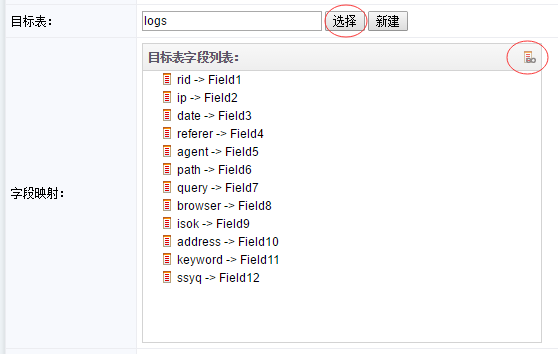

# 数据库导入

1.在**数据导入**页面点击**数据库导入**菜单，系统进入创建数据库连接页面，目前支持从MySQL、SQLserver、Oracle数据库导入数据到BI系统。

2.录入目标数据库的ip/端口/名称/用户名/密码等信息，点击**测试连接**按钮测试连接信息是否正确。

3.点击**保存**按钮可保存本次连接信息，保存后下次可直接从**选择已有连接**获取连接信息。

4.点击**下一步**，进入数据库导入配置页面，如下图：

5.在**导入SQL**输入框里录入查询SQL语句，点击**数据预览**查看SQL语句查询结果。如果是第一次导入，点击**新建**按钮来创建一个目标表。如果目标表已经存在，点击**选择**按钮从BI系统中选择表。

6.在新建表里录入表名，表字段，修改字段类型，完成后点击**确定**按钮创建表。

7.点击**选择**按钮选择刚才创建的表，系统会自动列出表字段。

8.点击上图右边按钮完成数据字段的自动映射，也可以点击字段列表手动和数据字段进行映射。

9.如果导入数据中有时间字段，点击时间戳**设置**按钮设置时间戳实现数据按时间戳增量导入。

10.点击**开始导入**导入数据到系统中，点击**取消导入**退出导入页面，点击**保存配置**保存此次导入的配置信息，下次可以从**配置信息**菜单进入快速导入。