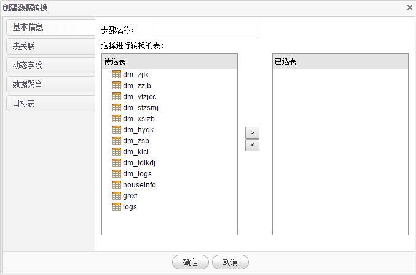
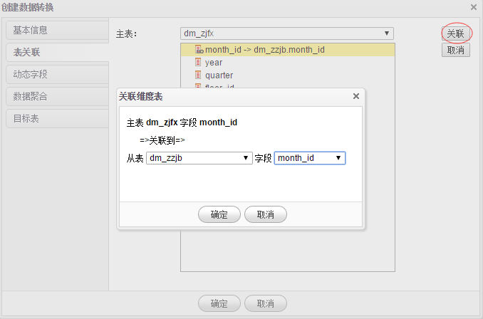
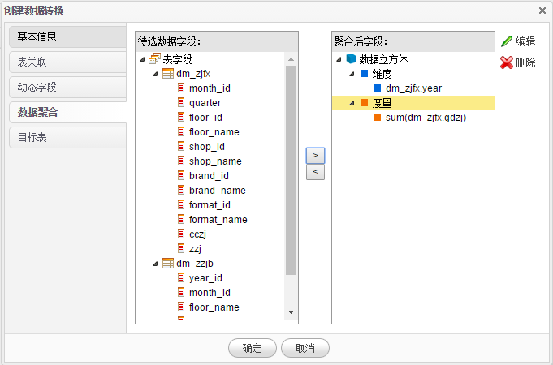

# 数据转换

1.在**数据导入**页面点击**数据转换**菜单，系统进入数据转换页面。数据转换主要实现对BI系统中已经导入的数据，通过关联、转换、聚合等运算生成新的目标表。

2.点击**新增**按钮来创建一个新的数据转换，在列表上点击**右键**可以执行、修改、删除一个数据转换。

3.数据转换主要包括基本信息、表关联、动态字段、数据聚合、目标表等内容。在基本信息选项卡，选中**待选表**中的表，点击 **>** 按钮选择表到已选表。

4.在表关联选项卡，选择需要关联的字段，点击**关联**按钮，弹出需要关联的表及字段的对话框，选择需要关联的表及字段后，点击**确定**按钮完成表关联。

5.在动态字段选项卡，用户可以创建新的字段，比如 C 字段是由 A+B 得到，即可建一个 C 的动态字段，字段表达式是  A+B。点击**新增**按钮创建一个新的动态字段，需要录入字段名称、表达式、字段类型等内容。

6.在数据聚合选项卡，需要把关联后的数据集聚合到一个由维度和度量构成的数据立方体中，先选择左边框的字段，再选择右边立方体的维度或度量，点击 **>** 按钮完成选择。