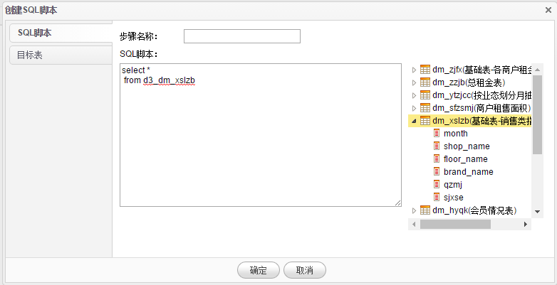

# 数据转换-SQL脚本

1.在**数据导入**页面点击**SQL脚本**菜单，系统进入SQL脚本页面。SQL脚本功能主要实现对BI系统中已有数据，通过自定义SQL查询语句来生成一个新的数据集，以提高数据处理及转换的灵活性。

2.点击**新增**按钮来创建新的SQL脚本。在列表数据上点击**右键**，弹出右键菜单，包括执行、修改、删除等操作。

3.录入SQL脚本名称，SQL语句（请注意：此处应该是一个查询的SQL语句），录入目标表名，选择存储方式,点击**确定**按钮完成创建。

4.在创建后的数据列表上点击**右键**，点击**执行**菜单，既立即执行这段SQL语句并把生成的数据写入目标表。点击**修改**菜单修改SQL脚本，点击**删除**菜单删除本条数据。

