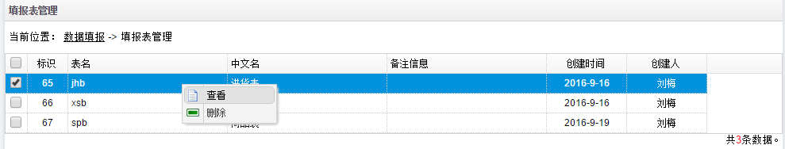
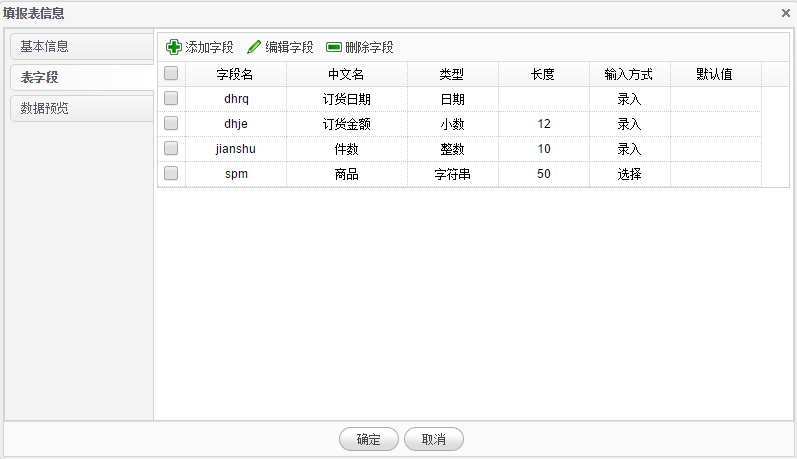

# 填报表管理

1.在**数据填报**页面点击**填报表管理**，系统进入填报表管理页面。管理页面列出用户已创建的所有填报表，可以在此修改填报表或删除表及数据。

2.在数据行上点击**右键**，在右键菜单上点击**查看**查看填报表的基本信息、字段信息及数据预览信息。

3.在**填报表信息**对话框的**表字段**选项卡中，列出了当前表的所有字段信息，用户可以在此创建新的字段，编辑已有字段或删除字段，添加及编辑字段方法请参考**创建填报表**。