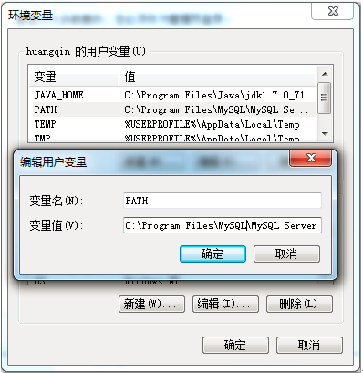
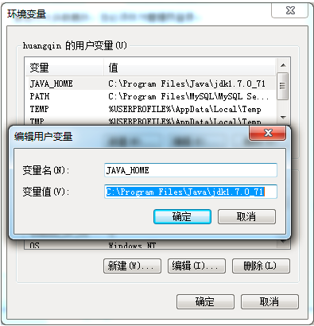

# 系统安装（企业版）

> 所需软件及版本：
>
> * MySQL5.5及以上版本；
> * JDK1.8及以上版本；
> * Tomcat8.0及以上版本;

从[成都睿思商智科技有限公司](http://www.ruisitech.com)网站下载最新版“睿思BI”企业版程序，下载地址：[睿思BI企业版下载](http://www.ruisitech.com/download.html)

1.安装MYSQL

MySQL下载地址：[MySQL5.5](http://www.ruisitech.com/tools/mysql5.5.27_win64_zol.zip)，下载后直接解压安装即可。安装完成后，请在环境变量中设置mysql 的path，如下图：



本电脑上MySQL路径为：C:\Program Files\MySQL\MySQL Server 5.5\bin

2.安装JDK

JDK下载地址：[http://www.ruisitech.com/tools/jdk-8u191-windows-i586.exe](http://www.ruisitech.com/tools/jdk-8u191-windows-i586.exe).下载完成后直接安装即可。安装完成后，请在环境变量中设置JAVA\_HOME, 如下图：



本电脑上JDK路径：C:\Program Files\Java\jdk1.8.0\_181

3.安装Tomcat

Tomcat下载地址：[http://www.ruisitech.com/tools/apache-tomcat-8.0.44-windows-x64.zip](http://www.ruisitech.com/tools/apache-tomcat-8.0.44-windows-x64.zip "Tomcat8")，下载完成后解压即可。进入Tomcat 的 bin 目录，执行startup.bat文件启动tomcat，如果启动失败，请先设置JAVA\_HOME环境变量。

4.安装数据

解压睿思BI下载文件夹中 bi数据.zip, bi数据.zip包含 yunbi\_sys.bak 及 yunbi.bak 两文件，分别对应MYSQL两个数据库。

进入MYSQL建立 yunbi\_sys 数据库及 yunbi 数据库，注意名称一致。

```
mysql -u root -p               //在命令提示符（CMD）里进入MySQL
create database yunbi_sys      //创建yunbi_sys数据库
create database yunbi          //创建 yunbi数据库
```

在命令提示符（CMD）里用mysql命令还原数据到数据库中，相关命令为：

```
mysql –uroot –pxxxxxx yunbi_sys<G:\data\yunbi_sys.bak  
mysql –uroot –pxxxxxx yunbi<G:\data\yunbi.bak
```

请注意bak文件路径，其中xxxxxx代表你的数据库root账号的密码。

如果mysql 在还原数据时报错：  Unknow command '\''， 请在命令上加上编码语句，如下：

```
mysql -uroot -p --default-character-set=utf8  yunbi_sys<G:\data\yunbi_sys.bak
```

5.安装Redis

Windows版本Redis下载地址：[http://www.ruisitech.com/tools/Redis-x64-3.2.100.msi](http://www.ruisitech.com/tools/Redis-x64-3.2.100.msi)

下载完成后直接安装即可。

6.安装程序

把下载文件夹中bi.war拷入 TOMCAT 的 webapps 目录。启动Tomcat后文件会自动解压到bi目录。

修改 WEB-INF/classes/application.properties 文件，主要修改 password 这项内容，既你数据库账户root的密码，如果您的MYSQLroot密码是123456，则不用修改。

```
jdbc.driver=com.mysql.jdbc.Driver
jdbc.url=jdbc:mysql://localhost:3306/yunbi?useUnicode=true&characterEncoding=utf-8&allowMultiQueries=true
jdbc.username=root
jdbc.password=123456
```

修改redis配置，在WEB-INF/classes/application.properties文件中，主要修改redis.host和redis.port两项配置。

```
##################redis############################################
redis.host=localhost
redis.port=6379
redis.dbIndex=1  
redis.expiration=3000  
redis.maxIdle=300  
redis.maxActive=600  
redis.maxWait=1000  
redis.testOnBorrow=true
```

启动tomcat, 输入 [http://localhost:8080/bi](http://localhost:8080/bi) 访问系统，如果看到登录页面，系统配置成功。

登录用户名/密码：admin/123456

7.系统激活

通过admin账户登录系统，在首页点击**激活试用**按钮，如下图:


录入基本信息，点击**确定**按钮完成激活。请注意，激活系统需要使用外网，请保证系统所在服务器能正常上网。激活成功后，用户可以免费使用30天，超过30天后需要购买才能继续使用，购买报价请进入我公司官网咨询。

至此，系统已经能够正常使用。如果需要更多功能，还需要如下配置。

8.其他配置

1.） 上传文件地址配置：

修改bi/WEB-INF/ext2/ext-config/ext-config.xml文件如下内容：

```
<constant name="upFilePath" value="/webdata/tmpdata/" />
```

其中upFilePath常量配置的地址即为上传文件存放地址。配置完成后上传的图片，csv，excel文件会放到此目录。

2.） 发送邮件账户配置：

修改 bi/WEB-INF/classes/application.properties 文件如下内容：

```
#######################################发送邮件配置###############################################
#发邮件的服务器地址
mail.host=smtp.163.com
#端口
mail.port=25
#发邮件账号
mail.userName=ruisitech@163.com
#发邮件密码
mail.password=
```

填写您的发邮件账号信息。

3.\) elasticsearch配置：

修改 bi/WEB-INF/classes/application.properties 文件如下内容：

```
################################elasticsearch ###############################################
elasticsearch.url=http://172.30.3.224:9200
```

4.）单点登录配置：

修改 bi/WEB-INF/classes/application.properties 文件如下内容：

```
################################sso 配置信息 ###############################################
sso.url.userInfo.bystaff=
sso.url.userInfo.bytoken=
sso.url.userList=
```


