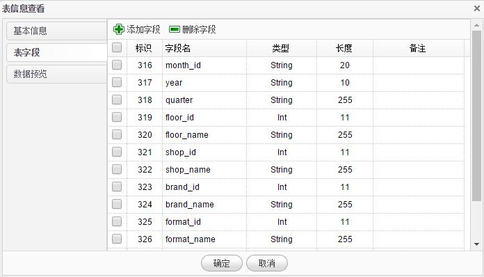
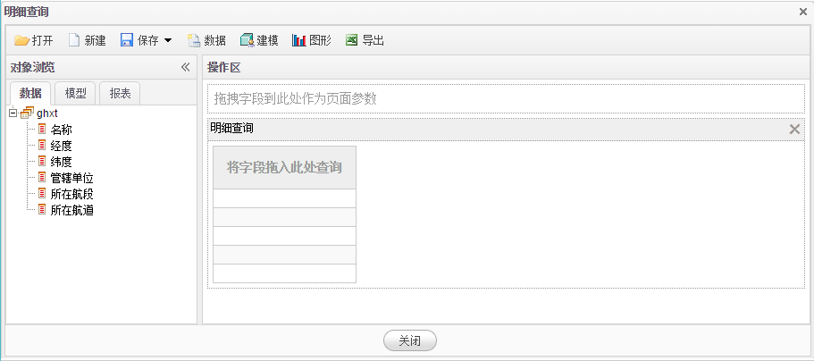

# 已有数据

1.在**数据导入**页面点击**已有数据**菜单，系统进入查看BI系统中已有数据页面。BI系统的数据来源主要包括4个方面。**导入表**是通过数据导入生成的数据，**聚合表**是通过数据转换生成的数据，**SQL表**是通过SQL脚本生成的数据，**填报表**是用户在数据填报功能中创建的表格。

2.在列表数据上点击**右键**，在弹出右键菜单上点击**查看/编辑**菜单查看数据表信息及表字段。

3.在**表信息查看**对话框可以修改表名，添加、删除字段，预览数据等操作。

4.在**右键**菜单上点击**查询**菜单，可对表数据进行灵活查询，更多查询方法请浏览**明细查询**模块。

5.在**右键**菜单上点击**删除**菜单，可删除此表及相关数据。

